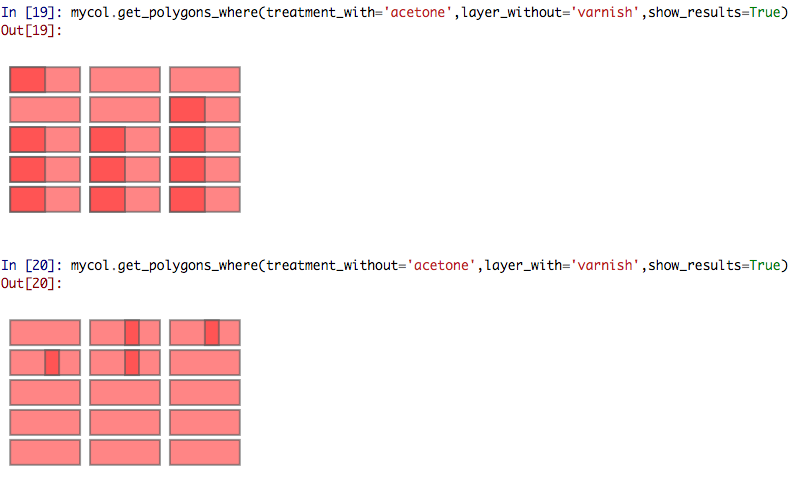

# Python svg samples collection designer

This Python script allows to create a modified `.svg` representing a flat samples collection. A flat samples collection is a group of flat samples (e.g. some pieces of metals with different varnishes, a series of coloured tiles ...). The samples are contained in a samples holder that can be used as reference system. You can store the information about the coatings and treatments applied to each samples and improve the replicability of your samples collections.


### Create, automate measurments and visualize
The `.svg`uses the standard color coding of laser cutters so you can cut the samples and the samples holder with your laser cutter. If you don't have one you can find a [FabLab next to you](https://www.google.com/maps/search/fablab/) or use an [online service](https://www.google.com/search?q=online+laser+cutting).

Once you have your physical samples collection,if you have a positioning system (microscope stages, linear stages etc. etc.) and the ability to communicate with them using macros or scripts you can query the `.svg` file for getting the coordinates and positioning your instrument on the sample (or the part of the sample) you are interested in.

The `.svg`can be read with any browser. The mouse over tooltip can show to anybody what's the last layer of your sample.

### Installation
You can install it using pip from terminal or from the ipython console:

    pip install git+https://github.com/giacomomarchioro/pysvgsamplescollection

### Create an .svg samples collection
Writing a script can give the opportuinity to others to replicate your samples collection easily.
```python
from svgsamplescollection import SamplesCollection
mycollection = SamplesCollection()
# We can set the name of the collection
mycollection.name = 'Test samples collection'
mycollection.add_creator('Joe Foe')
mycollection.publisher = 'University of Verona'
# The dimension (better if we use ISO dimenso for reusability)
mycollection.set_samplesholder_dimension.A4()
# Also the dimension of the samples should be standardized
mycollection.set_sample_dimension.Microscope_slide()
mycollection.set_number_of_samples(15)
mycollection.margin_top_mm = 10
mycollection.margin_bottom_mm = 10
# Here we create the sample holder
mycollection.create_sample_holder()
# The steps are the foundamental subdivisions of the creation of your collection
mycollection.add_step("Cut the samples from a wood laminate")
mycollection.populate_with_samples('wood')
# we start form the second sample (python start from index 0)
mycollection.add_step("Cover with vermilion in egg tempera all the samples except one.")
for sample in mycollection.samples[1:]:
    # we add to each sample excpet the first a layer of vermilion egg tempera
    sample.add_layer("vermilion egg tempera", "brush", width_percent=0.9)
mycollection.add_step("Add the varnish from the first to the fifth sample")
for sample in mycollection.samples[1:5]:
    # from the second to the fifth we add a varnish
    sample.add_layer("varnish", "brush", width_percent=0.7)
mycollection.add_step("Irradiate samples using UV light.")
for sample in mycollection.samples[::2]:
    # eventually we add a treatment using UV light 
    sample.add_treatment("uv curing", 
                            parameters = {"duration": "5 h",
                                        "wavelength_nm":"290"},
                            height_percent=0.5)
mycollection.add_step("Clean the samples using acetone.")
for sample in mycollection.samples:
    # finally we clean all the sample using acetone
    sample.add_treatment("cleaning", "acetone",width_percent=0.5)
mycollection.insert_alignment_MTF_standard()
mycollection.insert_scalebar()
mycollection.insert_standard()
# we save the svg file with all the information
mycollection.save_svg()
# and the masks
mycollection.save_masks_svg()
# we can save the mask and the sample holder also in dxf
mycollection.save_dxf()
```
The result is shown at the top of the page, right clicking on it you can use `open image in a new tab` to explore the sample collection with mouse over tooltips. The mask can be used for facilitating the creation of the samples. For instance you can place a mask for covering the region of your samples that you don't have to treat or coat. 

### Read and query the .svg file
The position of the samples can be retrieved using the `ReadCollection` class.
```python
from svgsamplescollection import ReadCollection
mycol = ReadCollection('Test samples collection.svg')
mycol.get_samples_position()
Out[1]: 
[(20.0, 20.0, 90.0, 45.0, 0),
 (100.0, 20.0, 170.0, 45.0, 1),
 (180.0, 20.0, 250.0, 45.0, 2),
 (20.0, 50.0, 90.0, 75.0, 3),
 (100.0, 50.0, 170.0, 75.0, 4),
 (180.0, 50.0, 250.0, 75.0, 5),
 (20.0, 80.0, 90.0, 105.0, 6),
 (100.0, 80.0, 170.0, 105.0, 7),
 (180.0, 80.0, 250.0, 105.0, 8),
 (20.0, 110.0, 90.0, 135.0, 9),
 (100.0, 110.0, 170.0, 135.0, 10),
 (180.0, 110.0, 250.0, 135.0, 11),
 (20.0, 140.0, 90.0, 165.0, 12),
 (100.0, 140.0, 170.0, 165.0, 13),
 (180.0, 140.0, 250.0, 165.0, 14)]
# select layers where there is vermilion
 mycol.get_layers_position(WITH='vermilion')
```

Using this class and shapely  is possible to perform some basic spatial query, selecting regions of interest where some conditions are met. With QTconsole is possible to see the regions selected.



### Requirements

For plotting and querying the collection shapely is required. While for exporting to .dxf is required edxf module.


